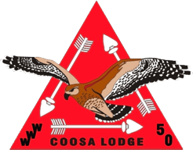

Alertness to the needs of others is the mark of the Vigil Honor. It calls for an individual with an unusual awareness of the possibilities within each situation.

The Vigil Honor is the highest honor that the Order of the Arrow can bestow upon its members for service to lodge, council, and Scouting. Membership cannot be won by a person's conscious endeavors.

The Vigil Honor is a high mark of distinction and recognition reserved for those Arrowmen who, by reason of exceptional service, personal effort, and unselfish interest, have made distinguished contributions beyond the immediate responsibilities of their position of office to one or more of the following:

* Lodge
* Order of the Arrow
* Scouting community
* Scout Camp

Under no circumstances should tenure in Scouting or the Order of the Arrow be considered as reason enough for a Vigil Honor recommendation.

Any member of the Order of the Arrow registered in Scouting and in good standing in a regularly chartered lodge is eligible for recommendation to the National Order of the Arrow Committee for elevation to the Vigil Honor provided that, at the time of the recommendation, the individual has been a Brotherhood member for a minimum of two years. A lodge may nominate a maximum of two percent of their registered Arrowmen once a year, through the Vigil Honor petition. At least 50 percent of all nominated must be under 21 at the time of nomination.

(Text copied from [https://oa-bsa.org/program/awards/vigil-honor](https://oa-bsa.org/program/awards/vigil-honor).)

The following Arrowmen have been recognized with the Vigil Honor by Coosa Lodge #50.

Date       | Recipient        | Vigil Name | Translation
:--------- | :--------------- | :--------- | :----------
2000 | Adam Barbe | Gattamen Sachgagunummen | One Who Desires To Lead
2000 | Marlin Cox | Matschiton Wachtschu Lenno | Mischievous Mountain Man
2000 | William Hayes | Tgauchsin Nutiket | Good Natured Guardian
2000 | David Hoover | Ngemewi Allogagan | Consistent Servant
2000 | Drew Isom | Tgauchsin Takachsin | Sociable Leader
2000 | James Munday | Gischeleman Kiginolewagan | Artist of Visions
2000 | Chris Pettit | Witscheman Nimat | Helpful Brother
2000 | Nathan Sedgewick | Klamachpin Allogagan | Quiet Server
2000 | David Self | Netami Sakima | First Chief
2000 | Charles Simmons | Tschitanek Sekistechink Gentgeen | Fast Feet Dancer
2000 | Matthew Valente | Machque Wentschijeyin Wundchenneu | Bear From The West
2000 | John Wygal | Nageuchsowgan Ganschelalogen | Confident Performer
2000 | Mr. Glenn Creamer | Achewon Wulalogewagan | Spiritual One Who Does Good Work
2000 | Mr. David Dubose | Achipiquon Achgeketum | Musical Instruments Teacher
2000 | Mr. Jason Mosakowski | Anicus | Mouse
2000 | Mr. Jackie Pettit | Amangi Klakaptonaganall | Large Amusing One
2000 | Mr. Dan Strunk | Nuwingi Achewalogen Weuchsowagan | Willing Worker Who Has Knowledge
2000 | Mr. Gary Wright | Wingolauchsik Meteu | Cheerful Medicine Man
 |||
2001 | Tim Burns | Achgeketum Takachsin Pa'an | Teacher of Leaders to Come
2001 | Mark DeRamus | Tschitgussin Mawememen Nimat | Silent Gatherer of Brothers
2001 | David Ferguson | Nosogamen Lungwamen | One Who Follows His Dreams
2001 | Anand Iyer | Lilchpin Nimat Nundajelensuchien | Diligent Worker Who Goes Humbly
2001 | Andrew Land | Pakantschienchen Wojauwe | Accomplished Chief
2001 | Kevin Pocus | Machelemuxit Kichkinet Wuliechsin | Honored Guide Who Pronounces Well
2001 | Bill Souder | Klamachpin Takachsin Gischiha | Quiet Leader Who Works With Hands
2001 | Col. Kent Jackson | Netopalis Genachgihan Wikimak | Soldier Who Takes Care of His Wife
2001 | Mrs. Judi Knoop | Klampeechen Tangetto | Stillwater Little One
2001 | Mr. John Pocus | Nachgundin Gischachgeniman | Agreeable Judge
2001 | Mr. Tad Thomason | Allogagan Nischa Taga'wan | Servant of Two Houses
 |||
2002 | William Davis | Nagatamen Klamachpin | Reliable Quiet One
2002 | Cory Phillips | Tekene Achpamsin | Forest Walker
2002 | Justin Ruf | Achowalogen Tangetto Waskeu | Hard Worker Who is Small and Narrow
2002 | Brian Russell | Meechgalhukquot Elogamgussit | Red Headed Messenger
2002 | George Saunders | Tschitqui Gischikheu | Silent Organizer
2002 | Jeffrey Wagner | Wischixin Netopalis | Active Warrior
2002 | Phillip Webster | Achewon Achgegingen | Spiritual One Who Teaches
2002 | Paul Whittle | Wulamallessin Memhallamund | Happy Trader
2002 | Daniel Wright | Kichkinet Gischihan | Guide Who Creates With His Hands
2002 | Mr. Dan Ingram | Kitschiwi Peuchtowagan | Truly Patient
2002 | Mr. Anthony Messer | Papesu Achege'gin Nachpikin | Patient Teacher of Nature
2002 | Mr. Mason Ruf | Achowalogen Elgigunkhaki | Hard Worker Who is Big and Wide
2002 | Mr. Chad Skelton | Klamachpin Lekhiket | Quiet Writer
2002 | Mr. Richard Souder | Machelensin Allogagan | Proud Servant
2002 | Mr. Delane Terrell | Wowoatom Gischihan Wulissowagan | Skillful Artist
2002 | Mr. Chris Whitehead | Machelemuxit Tschitanessoagan | Honored One Who Has Authority
 |||
2003 | Daniel Berry | Wowoatam Alluns | Skillful Archer
2003 | Robert Brown | Klamachpin Nachpikin Pemsit | Quite Nature Walker
2003 | Blake Edwards | Wulelendamuwi Achipiquon | Joyful Musician
2003 | Jim Ellison | Nochnutemaliuwet Schachachkaptonen | Keeper Of Records
2003 | Loring Jones IV | Wowoatam Elauwit | Skillful Hunter
2003 | Ben Putnam | Lilchpin Gentgeen | Diligent Dancer
2003 | Mitch Relfe | Gopens Gomuus Pisgaje | He Who Bears Much On His Shoulders
2003 | Drew Schwaiger | Wil Lowulen | Head Of Fire
2003 | Noah Terrell | Klamachpin Wiechcheu | Quiet Wolf
2003 | Patrick Waller | Aptonagan Wikhetschik | Chapter Builder
2003 | Mr. Gary Beus | Wunita | One Who Knows How
2003 | Mr. Ken Deason | Kichkican Woapalanne | Man Who Guides Eagles
2003 | Mr. Larry Sitz | Gluxu Ktemaque | Laughing Beaver
2003 | Mr. Terry Wagner | Achowalogen Najundam | Hard Worker Who Carries A Load
 |||
2004 | Wilson Griffith | Amangi Wachtey Gilkissin Kichkinet | Large Bellied Laughing Guide
2004 | Nick Harper | Lilchpin Elangomat | Diligent Elangomat
2004 | Joey Kiker | Amangi Allowat Wundaman Sakima | Large and Mighty Ceremony Chief
2004 | Gabriel Moore | Nolemiwi Guneu Milach Achowalogen | Unseen Long Haired Worker
2004 | Zach Pettit | Tatchen Klakaptonagall | Little Amusing One
2004 | Thomas Stanley | Ktemaque Achgook Elauwit | Beaver and Snake Hunter
2004 | Dr. John Ennis | Schindikeu Beson Achgeketum | Wilderness Medicine Teacher
2004 | Mr. Martin Foote | Wischiki Gokhotit | Busy Little Owl
2004 | Mrs. Mary Lou Griffith | Gilkissin Woapalanne | Laughing Eagle
2004 | Mr. Doug Jackson | Welauchsit Lilenowagan Woapalanne | Organized Legal Eagle
2004 | Mr. Tony Myers | Wulelendam Sachgagunummen Chesimus | Joyful Leader of Younger Brothers
2004 | Mr. George Stanley | Awehhelleu Hakihet Wulalogewagan | Poultry Farmer Who Does Good Work
 |||
2005 | Matthew Hitt | Weuchsowagan Mechauwikenk | Knowledgeable Camper
2005 | Will Jackson | Meechgalhukquot Gischiken | Red Headed Organizer
2005 | John Meadows | Gunaquot Aptonen Wejjaweu | Tall Well Spoken Chief
2005 | Chris Porter | Wikhetschik Ganschinaquist | Builder of Ceremonies
2005 | Evan Sanderson | Mechinkhakihakan Netopalis | Field Warrior
2005 | Matthew Sheets | Gischachgenuthsu Aschowin | Determined Swimmer
2005 | Charles Snoddy | Kichkinet Peton Gluksowak | Guide Who Brings Laughter
2005 | John Spitler | Wulelendan Nuningi Nutiket | Cheerful Willing Guide
2005 | James Tarbox | Lilchpin Gachpees Sachgagunummen | Diligent Twin Who Leads
2005 | Travis Tarbox | Gachpes Wulamallessin Gauschewen | Twin Who Makes Cheerful Sounds
2005 | Andrew Wagner | Klakaptonaganall Petachgussin | Amusing Climber
2005 | Mr. Irvin Brown | Gluxu Takachsin Chesimus | Laughing Leader of Young Brothers
2005 | Mr. Wayne Jackson | Achkegetum Gischenaxin | One Who Teaches Safety
2005 | Mr. Charles Knoop | Awehhelleu Elauwit | Bird Hunter
2005 | Mr. Larry Mitchell | Topalowagan Woapalanne | War Eagle
2005 | Mr. Kevin Moore | Sakima Ganschinaquist Gischenaxim | Chief Ceremony Planner
2005 | Mrs. Shannon Myers | Dachiqu Oagan Mawachpo | Patch Collector
2005 | Mr. David Schwaiger | Gokhos Petasummawan | Owl Who Brings Light
2005 | Mr. Paul Schwaiger | Sisi'Lija Petasummawan | Buffalo Who Brings Light
2005 | Mr. Roy Vincent | Tschutti Woapalame | Friend of Eagles
 |||
2006 | Chris Arnold | Nuwingi Kichkinet Allohakasin | Willing Guide Who Instructs
2006 | Damon Ashley | Klamachpin Elauwit Gentgeen | Quiet Hunter Who Dances
2006 | Nicholas Blevins | Wuhhala Netopalis | Defending Warrior
2006 | Jordan Gandy | Achowalogen Amangiechsin | Hard Worker With Large Voice
2006 | Stephen Hayes | Gentgeen Mikemossit | Dancer Laborer
2006 | Philip Irions | Llau | Man of Valor
2006 | Matthew Myers | Pachtschuppea Wsit Gentgeen | Soft-Footed Dancer
2006 | Patrick Ruf | Litchewagan Kichkinet | Thoughtful Guide
2006 | Eric Vincent | Achewon Auwen Nachgohuman | Strong One Who Sings
2006 | Ben Wygal | Nechasin Sachgagunummen | Meticulous Leader
2006 | Mr. Gary Kiker | Gilkissin Machque Allohakasin | Lauging Bear Who Instructs
2006 | Mr. Philip Marks | Nendawen | Lamp Carrier
2006 | Mr. Bill McCoy | Achgeketum Nagatamen | Teacher Who Can Be Trusted
2006 | Mr. Bernard Sanderson | Tuney Kichkinet Chesimus | Bearded Guide of Younger Brothers
2006 | Mr. Tim Smalley | Nagatamen | Trusted One
 |||
2007 | Charles Backus | Papesu Peptukquekhikenk Gentgeen | Patient Hoop Dancer
2007 | Logan Bridges | Nutiket Pochenikan | Guard of the Drum
2007 | Logan Dawson | Klamachpin Aschowin Sachgagunummen | Quiet Swimmer Who Leads
2007 | Ryan Dawson | Tgauchsin Aschowin Sachgagunummen | Friendly Swimmer Who Leads
2007 | Nathan Hatch | Klamachpin Achowalogen Kichkinet | Quiet Hard-Working Guide
2007 | Ed Hicks |  |
2007 | Taylor Hide | Nendawen Lapeechton | Torch-Bearing Musician
2007 | Gregory Kieth | Lilchpin Meteu Sachgagunummen | Diligent Medicine Man Who Leads
2007 | Joseph Rush | Apendamen Wuski Temiki | One Who Enjoys New Things
2007 | Adam Spitler | Nutiket Achtschipaptonen | Guard With Deep Voice
2007 | Mrs. Deanna Ashley | Gelieclihammen Wewingtonheet | Seamstress Who Likes to Talk
2007 | Mr. Alec Cameron | Nagatamen Nhakeuchsin Kikeyjumhet | Reliable
2007 | Mrs. Renee Garner | Lilchpin Woakus | Diligent Grey Fox
2007 | Mr. Ed Hicks |  |
2007 | Mr. John Hill | Chans Mamchachwelendam | Elder Brother Who Endures
2007 | Mr. Brett Melton | Elangomat Dachiquoagan Memhalamund | Friend Who Trades Patches
2007 | Mr. David Murphree | Mawenemen Waselenikan | Gatherer of Light
2007 | Dr. Richard Russell | Nhakeuchsin Meteu Sachgagunummen | Respected Doctor Who Leads
2007 | Hon. Malcolm Street | Achgegingewagan Gischachgeniman | Training Judge
2007 | Mr. Eric Sullivan | Eschochwalan Topalowoagan | Helper of Scouts
 |||
2008 | Glenn Houston | Dachiqnoagan Memhallamund Wendamen | Patch Trading Fisherman
2008 | Devan Beitel | Gintschimuin Gintschimuin | Beep Beep
2008 | Andrew Dotson | Passitechin Kikewagan | Clumsy Healer
2008 | Joshua Ritchie | Getteninak Ptukalluns Pakitan Ilau | Jolly Disc Throwing Chief
2008 | Yancey Key | Wingolauchsik Nagatamen Wulihilleu | Cheerful Reliable Worker
2008 | Kyle McInnis | Papeju Mitachkaniechiton Wojauwe | Patient Ceremony Chief
2008 | Mr. Bubba Fountain | Gaton Mechmauwikenk Witaloven | Hidden Camp Worker
2008 | Mr. Tom McInnis | Epigachink Wikhetschik | Foundation Builder
2008 | Mr. Ed O'Neal | Gunaxin Allowelendamoagan | Tall One Who Is Highly Esteemed
2008 | Mr. Greg Crenshaw | Wtelgixin Gischihan | Worthy One Who Creates
2008 | Mrs. Sheila Knight | Tgauchsin Anatschitan | Friendly One Who Cares
 |||
2009 | Nathan Bradbury | Gunaquot Lilchpin Allogagan | Tall Diligent Servant
2009 | William Cole | Kwehihwikat Hitawke | Long Legged Dancer
2009 | Richard Ethan Merrell | Aspitunk Sakima | Cheaha Chief
2009 | Jacob Murphree | Gentgeen Chesimus Allogagan | Dancing Brother Who Serves
2009 | Charles Owen | Pemepesink Kichkinet | Running Water Guide
2009 | Rutland Price | Kantahpu Kshihele | Hidden Runner
2009 | Ryan Sweeney | Witahemui Sakima | Service Chief
2009 | Mrs. Connie Abercombrie | Mikemosit Sisilia | Hard Working Buffalo
2009 | Mr. John Bowers | Nimat Tolepomao | Adviser of Brothers
2009 | Mr. Scott Brannan | Kanchixin Mikhatin Mikemosit | Hidden Camp Worker
2009 | Mr. Larry Faulkner | Lunkon Ehashentesit | Wing Trader
2009 | Mr. Anthony Hall | Chikelet Eholat Elangomat | Guide Who Loves Chocolate
2009 | Mr. J. Michael Key | Ophukon Newichemekuna | White-haired Helper
2009 | Mr. Abe Rummell | Kanchixin Kwenakw Sakima | Hidden Tall Chief
2009 | Mrs. Lisa Sullivan | Elahtuniket Alepomi | Venturing Advisor
 |||
2010 | Chris Bright | Meechgalhukquot Wulatenamuwi Nimat | Red-haired cheerful brother
2010 | Kyle Dotson | Nuwingi Mikemossit Kwsitao | Willing Worker Who Smiles
2010 | Patrick Hayes | Tgauchsin Nimat | Good Natured Brother
2010 | James Jones | Klamachpin Lilchpin Mikemossit | Quiet Diligent Worker
2010 | Patrick Kidd | Luppoewagan Mikemossit | Witty Laborer
2010 | Jonathan Kunka | Wundelemuin Alukakn | Kind Hearted Reliable Servant
2010 | Alex Pope | Malxkwsitke Yuchi Sakima | Dancing Yuchi Chief
2010 | Mr. Phil Ashley | Klamachpin Kichkinet Hitawkeyok | Quiet Guide to Dancers
2010 | Mr. Darren Britton | Aspitunk Ilau | Cheaha Warrior Chief
2010 | Mr. Mike Read | Gebtschaat Paiachkhikan Achgeketum | Joking Rifle Instructor
2010 | Mrs. Michele Reavis | Lilchpin Gohkus Maniton Pimenatan | Willing Owl Who Makes With Thread
2010 | Mr. Tim Rogers | Manitu Aney Kimahtk | He Who Builds Paths for Brothers
2010 | Mr. Warren Glea Sarrell | Machelemuwi Nikanixink | Honorable one who leads
2010 | Mr. Joe Turner | Kwishkwei Eschochwalan | Silent Helper
 |||
2011 | David Marsh | Hitavwnakwsu Yuchi Nikanixink | Talented Yuchi Leader
2011 | Nathan Moore | Witshceman Pilhiksutin Minsi Meteu | Helpful Ceremony Team Medicine Man
2011 | Will Reavis | Lilchpin Wehixenis Sakima Xahulamu | Willing Cook Chief Who Talks Loud
2011 | John Rogers | Welankunsu Nutiket Wewintonheet | Friendly Guard Who Likes To Talk
2011 | Will Tidwell | Wingolauchsik Tendeuchen | Cheerful Firebuilder
2011 | Jacob Smith | Gischachgenutasti Nipsu Kichkinet | Determined Eager Guide
2011 | Mr. Jim Colson | Lilchpin Mikemossit Paiachkhikan | Willing Worker Who Instructs
2011 | Mrs. Marty Jones | Allohak Nimat | Fierce Brother
2011 | Mr. Loring Jones III | Okeksene Wetupalit | Sockless Hunter
2011 | Dr. Larry Lee | Wingolauchsik Meteu | Cheerful Medicine Man
2011 | Mrs. Amanda Moore | Wichem Nenajungeshammen Salassett | Helping Horseback Rider Who Cooks
2011 | Mr. Mike Ward | Allogagan Wimb | Servant Heart
2011 | Mr. Kieth Wycoff | Welimkwesu Lileno Nkakewsewakan | Well Spoken Of Office Helper
 |||
2012 | Tyler Belk | Ahpikona Allogagan | Musical One Who Serves Many Roles
2012 | Ben Crenshaw | Pohonasin Yuchi Sakima | Drumming Yuchi Chief
2012 | Davis Faulkner | Tschitanitehen Atschimolsin Nimat | Persevering Converter of Brothers
2012 | Micah Gilliland | Mizin Skikw | Dude Who Eats Grass
2012 | Sam Hardy | Nuwingi Newo Weshkinkw Nutiket | Willing Four-Eyed Guard
2012 | John Mayhall | Nachgohuman Machque Wikhetschik | Singing Bear Who Builds Chapters
2012 | Richard Cole Thorton | Chitaninu Hwikat Yuchi Lentkan | Strong Legged Yuchi Ceremonialist
2012 | Patrick Yim | Memhallamund Sakima Ichauweleman | Trading Chief Who Enables Others
2012 | Mr. Doug Adair | Atschimolsin Wemihele Kikinhet | Legal Brother Who Spreads Scouting
2012 | Mr. Randy Dotson | Sekahseni Nehenaonkes Ehalemskuses | Iron Horse Conductor
2012 | Mrs. Jana Mayhall | Hemptet Mawachpo Anati Machque | Patch Collecting Momma Bear
2012 | Mrs. Yolanda Pleasant | Tospenaok Chesimus | Fox Who Inspires Many Youth
2012 | Mr. Fred Roddam | Wetochwink Maweni Tepawtu | Father Who Gathers At A Fair Price
2012 | Mr. Dan Trust | Lowaneu Gentgeen Netopalis | Northern Dancing Warrior
 |||
2013 | Dylan Clark | Maxkixekene Xalahputisikaon Sakima | Red Headed Web Chief
2013 | Adam Davis | Togihillian Sachgagunmen | Rising Leader
2013 | Forrest Evans | Chakahchu Kaskanampo Sakima | Frozen Kaskanampo Chief
2013 | Trey Houston | Chitkuwi Allogagan Elhaket Nutiket | Silent Serving Den Guard
2013 | Luke Lockwood | Gunaxit Wehixenis Goquehemen Kenup | Tall Cook That Pushes The Button
2013 | Adam Moore | Tgauchsin Sipo Awenik Chans | Friendly Choctaw Big Brother
2013 | Hunter Morgan | Elauwit Hatemopil | Hunter Bus
2013 | Thomas Willingham | Chitkwesu Wachejeu Elauwit | Quiet Light Hunter
2013 | Dr. Dan Belk | Nuwingi Milan Tchen | Willing Giver Of Time
2013 | Mrs. Deborah Huff | Tindeuchen Putawen | Fire Starter
2013 | Mr. Ed Poniatowski | Ohuntam Kweni Payaxkhikan | Owl Long Rifle
2013 | Mr. Roger Pope | Lilchpin Nuwingi Achowalogen | Diligent Willing Hard Worker
2013 | Mr. Clay Pruitt | Elahtuniket Chitanesit | Scouting Is Strong With This One
2013 | Mrs. Theresa Read | Woapalanne Ajummen Hmalemake | Eagle Who Buys And Sells
2013 | Mr. John Ryan | Nagatamen Allogagan Nikanixink | Trusted Servant Leader
2013 | Mr. Melvin Walker | Nagatamen Allogagan Neliellataiik | Trustworthy Servant Of The Lord
 |||
2014 | Alex Brown | Tenduchen Wehwatewet | Fire Building Teacher
2014 | Nicholas Crenshaw | Takachsin Gischeleman | Leader Who Creates With His Mind
2014 | Alex East | Wundchenneu Ohchu Gokhos Kaxkeni | Western Mountain Owl Who Breaks
2014 | Colin Giles | Achowelendam Takachsin | Deep Thinking Leader
2014 | Jordan Lowe | Meteu Machque Kelkihel | Medicine Bear Who Brings Laughter
2014 | Jorge Marin | Wingolauchsik Ehahpikwes | Cheerful Music Player
2014 | Alexander McDowell | Woapalanne Allohakasin Aihamuk | Eagle Who Teaches Eagles
2014 | Liam Oswald | Nkeleksewinkwexi Gihim Winkalichik | Smiling One Who Encourages Friends
2014 | Sean Reavis | Klamachpin Majawiechton Witahemui | Quiet Organizer Who Serves
2014 | Noah Reed | Lilchpin Aiham | Diligent Golden Eagle
2014 | Vincent Sweeney | Wilawflihan Mpetao Wingolauchsik | Selfless One Who Brings Cheer
2014 | Mr. William Curtis | Meechgalhukquot Wtschitschanquiwi | Red Haired Spiritual One
2014 | Mr. Austin Landry | Maike Takachsin | Camping Leader
2014 | Mrs. Lu Ann Poniatowski | Poniatowski Tangelensui Pupukwesh | Humble Bob White
2014 | Mr. Micheal Findlay | Muxulhama Auwen Wiechenin | Sailor Who Cooks
 |||
2015 | Daniel Beitel | Lilchpin Witscheman | Diligent Helper
2015 | John Henry Glenn | Nipsu Elangomat Kenthu Hukweyunk | Enthusiastic Friend Who Soars High
2015 | Jameson Houston | Allogagan Nehellatank | Servant of the Lord
2015 | Christian Moomaw | Watemewinu Nikanixink Alukakan | Intelligent Leader Who Serves
2015 | Drew Perry | Teskawtu Ayape Chikenem Wetupalit | Racing Deer And Turkey Hunter
2015 | Eddie Poniatowski Jr | Nkeleksewinkwexi Topalowilenno | Smiling Warrior
2015 | Daniel Smith | Wingolauchsik Alukakan Alakil | Cheerful Servant Who Leaps
2015 | Aaron Wiggs | Wingolauchsik Metelensit Allogagan | Cheerful Friend Who Humbly Serves
2015 | Mr. Bob Brewer | Opitunaye Achimwis Ohuntam | White Bearded Storytelling Owl
2015 | Mr. Randall Cox | Sisilia Lohumanwan Mayawsu | Buffalo Who Demonstrates Integrity
2015 | Mrs. Jeanie Dotson | Kikehwet Kishelemienk Mimensak | Healer Of God's Children
2015 | Mr. Ken Dunn | Wingolauchsik Nutiket Shinkekink | Cheerful Guardian Of The Forest
2015 | Mr. Bud Moncrief | Sapeleantpe Ehamet Wehwatewet | Bald Headed Fisherman Teacher
2015 | Mr. Greg Sweatmon | Tipas Kimtunhe | Chicken Whisperer
 |||
2016 | Logan Dolloff | Alukakan Ntalemahe Pakenchu | Servant Who Throws The Disc
2016 | Ryan Hall | Welankunsu Nuwingi Nutiket | Friendly Willing Guard
2016 | Zachary Johnson | Sakima Gischileu | Chief Who Has Proven True
2016 | Adler Salem | Amoe Nulhalukw Alukakan Manitto | Beekeeper Who Serves The Lord
2016 | Joey Liberatore | Lakusu Wuskelenape Achgektum | Climbing Youth Teacher
2016 | Turner Atwood | Wulelendam Wewoatamowi Achgektum | Sprited Wise Teacher
2016 | Mr. Jim Charlton | Alukakan Mexelkik | Servant Of A Multitude
2016 | Mr. John Kelton | Mweshikakewoo Manitu Nikanixink | Artist Who Builds Leaders
2016 | Mr. Ron Moore | Wulilissowagan Nenustao Nikanixink | Compassionate Patient Leader
2016 | Mrs. Cindy Perry | Wingolauchsik Machque Witscheman | Cheerful Bear Who is Helpful
 |||
2017 | John Bateman | Wingolauchsik Tahkoptu Wehwatewet | Cheerful Knot Teacher
2017 | Wyatt Dunn | Ilau Nochnutemaliuwet Gigischquik | Brave Keeper Of History
2017 | Micheal Fuell | Nechochwen Meteu Wahhellemat | Lone Medicine Man From Afar
2017 | Jordan Gandy | Yuchi Najundam | Yuchi One Who Carries A Load
2017 | Jack Lewis | Nagatamen Nutiket Glistan | Faithful Guard Who Listens
2017 | Dalton Martin | Wixenu Wentamao Wiechenin Tipasak | Cook Who Shows And Cooks Chickens
2017 | Brandon Oswald | Tgauchsin Skiquall Hitawke Sanquen | Friendly Grass Dancing Ferret
2017 | Tyler Senn | Meechgalhukquot Wuliechsin | Red Headed One Who Speaks Plainly
2017 | Braden Taylor | Gihim Nimat | One Who Encourages His Brothers
2017 | Trey Tews | Alunsinutay Nischa | Buckshot Two
2017 | Jonathan Tindall | Achgegingewagan Woapalanne | Teaching Eagle
2017 | Mrs. Mary Breeden | Chitkuwi Kisuwak Kikanizxit Xkwe | Quiet Cooking Leader
2017 | Mrs. Michelle Colson | Lippoe Woapalanne Gischihan | Wise Eagle Who Creates With Hands
2017 | Mr. Roger Etherington | Nuwingi Takachsin Weskelenapeyok | Willing Leader of Young Scouts
2017 | Mr. Karl Hall | Gischihan Woapalanne | He Who Makes Eagles
2017 | Mr. Joe Pate | Amangiechsin Segachtek Woakus | Loud Enthusiastic Fox
2017 | Mr. Aaron Tews | Chans Gihim Elipsit | Elder Brother Who Encourages Units
2017 | Mr. Harold Young | Motit Machque Num Kshaxen Uteney | Little Bear From The Windy City
 |||
2018 | Aaron Black | Nuwingi Nimat Ehahpikwes | Willing Brother Who Plays Tuba
2018 | Trenten Charlton | Wulelendam Winkeohkwet Ehahpikwes | Joyous Lion Who Plays The Horn
2018 | Cade Hamm | Matschiton Nimat Machque Sakima | Mischievous Brother Bear Chief
2018 | Will Hamm | Chipetun Nimat Machque Sakima | Courageous Brother Bear Chief
2018 | Andrew Huffman | Nuwingi Achowalogen Kwelkesitao | Willing Worker Who Smiles
2018 | Nate Kelton | Tschitanitehen Allogagan | Persevering One Who Serves
2018 | Jesse Mayhall | Ktschukquilques Tangetto Machque | Little Bear Who Moves The Grass
2018 | Brendan Proaps | Wingolauchsik Memhallamund | Cheerful Trader
2018 | Gabriel Travis | Sakima Nkeme Ganschalogawagan | Chief Who Is Always Working
2018 | Mr. Trevor Chobot | Achewon Alloku Klamachpin | Strong Lean Quiet One
2018 | Mr. Josh Kennedy | Pempanik Ila Kichkinet Woapalanne | Sky Warrior Who Guides Eagles
2018 | Mrs. Suzanne Oswald | Ana Ktemaque Maniton Pimenatan | Momma Beaver Who Makes With Thread
2018 | Mr. Micheal Props | Lepweinu Aihamikwen Kikinhet | Wise Eagle Wing Scout
2018 | Mr. Hal Songer | Lehelutek Wehixenis Watun Ahi Keku | Iron Chef Who Knows Many Things
2018 | Mr. Donnie Strain | Temakelensu Alukakan Aiham  | Humble Servant Golden Eagle
2018 | Mr. David Tindall | Nihillatamen Tekene | Master Of The Woods
 |||
2019 | John Dodd Beck | Allogagan Wulaque | Servant of the Past
2019 | Evan Dolloff | Wulilisseu Allogagan Takachsin | Kind-Hearted Servant Who Leads
2019 | Paul Glenn | Klamachpin Meteu Pennauwelendam | Quiet Medicine Man Who Thinks
2019 | Walker Kelley | Wingolauchsik Allogagan Timmeu | Cheerful Servant Wolf
2019 | Jack Young | Wulelendam Kittahikan Sakima | Joyful Sea Chief
2019 | Mrs. Katy Anderson | Netashumwiset Pimtiepu Sisilieyok | Cowgirl That Rides With Buffaloes
2019 | Mr. Joe Finkel | Lippoe Kikeyjumhet | Wise Elder
2019 | Mr. Tyler Powell | Sakima Nutiket Menuppek | Chief Guardian Of The Water
2019 | Mrs. Jan Wilkinson | Sabbeleechen Tschutti Wemi | Sparkling Friend To All
