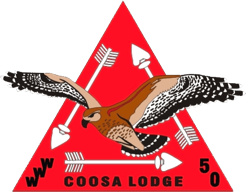

The Vigil Honor is the highest honor that may be bestowed on a member of the Order of the Arrow. It is given, not earned. Each lodge may petition the National Order of the Arrow to 
bestow the Vigil on a group of its members. To be eligible, an Arrowman must be registered in good standing with a unit or the council, be a current dues-paid member of the lodge, and 
be a Brotherhood member for a minimum of two years.

Recipients of the Vigil Honor are selected based on their dedication and continued service to the lodge, the Order of the Arrow, the Scouting community, and/or a scout camp.

The Vigil Honor Selection Committee operates as part of the Nominations and Recognitions Committee.

Date       | Recipient        | Vigil Name | Translation
:--------- | :--------------- | :--------- | :----------
09/xx/1915 | E. Urner Goodman | Nuwingi    | The Willing
xx/xx/1917 | Carroll A. Edson | Ahowapowit | The Strong 
|||
11/xx/2019 | Evan Dolloff     | Wulilisseu Allogagan Takachsin | Kind-Hearted Servant Who Leads
11/16/2019 | John Dodd Beck | Allogagan Wulaque | Servant of the Past
11/16/2019 | Evan Dolloff | Wulilisseu Allogagan Takachsin | Kind-Hearted Servant Who Leads
12/28/2019 | Paul Glenn | Klamachpin Meteu Pennauwelendam | Quiet Medicine Man Who Thinks
11/16/2019 | Walker Kelley | Wingolauchsik Allogagan Timmeu | Cheerful Servant Wolf
11/16/2019 | Jack Young | Wulelendam Kittahikan Sakima | Joyful Sea Chief
11/16/2019 | Mrs. Katy Anderson | Netashumwiset Pimtiepu Sisilieyok | Cowgirl That Rides With Buffaloes
11/16/2019 | Mr. Joe Finkel | Lippoe Kikeyjumhet | Wise Elder
11/16/2019 | Mr. Tyler Powell | Sakima Nutiket Menuppek | Chief Guardian Of The Water
11/16/2019 | Mrs. Jan Wilkinson | Sabbeleechen Tschutti Wemi | Sparkling Friend To All
